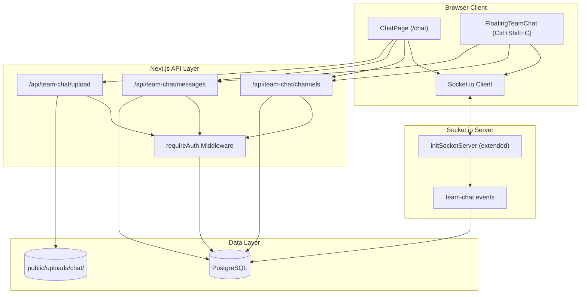
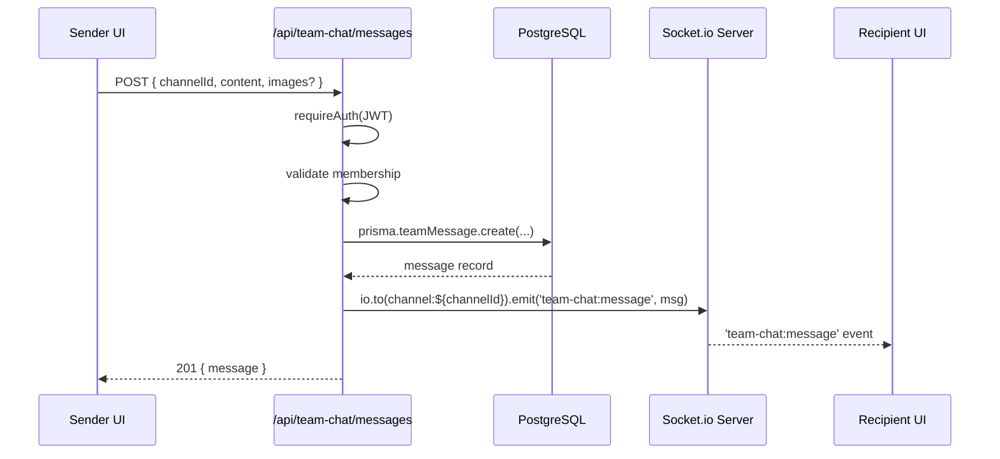
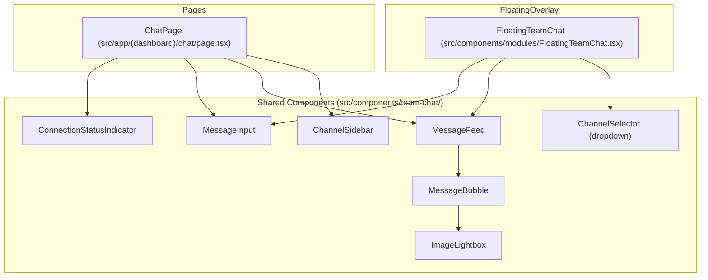
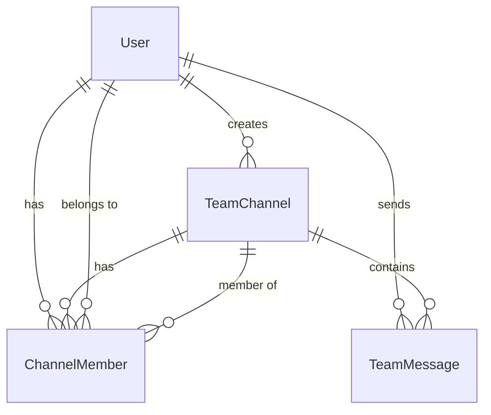

# Design Document: Founder Team Chat

## Overview

A real-time, channel-based internal team chat system for the Isocodelabs Ops Hub. The feature enables the two co-founders to communicate through persistent channels with text and image messaging. It provides two entry points: a dedicated full-page `/chat` route and a floating overlay panel (Ctrl+Shift+C) accessible from any page. The system leverages the existing Socket.io infrastructure for real-time delivery, Prisma/PostgreSQL for persistence, and the established JWT authentication model.

### Design Decisions

| Decision | Rationale |
|----------|-----------|
| Reuse existing `pages/api/socket.ts` + `initSocketServer` | Socket.io server already runs with JWT auth middleware. Adding team-chat events is additive — no new server needed. |
| Store images on local filesystem (`public/uploads/chat/`) | Existing upload pattern (see `public/uploads/legal/`). Two-founder scale doesn't require cloud storage yet. |
| Separate `TeamMessage` model (not reuse `ChatMessage`) | Existing `ChatMessage` is tied to AI chat context. Team messages have different schema (channel, images array, membership). |
| Floating panel mirrors `GlobalChatPanel` pattern | Consistency with existing framer-motion overlay (Ctrl+J). Same z-index layer, backdrop, spring animation. |
| Cursor-based pagination over offset | More reliable for real-time chat where new messages shift offsets. Use `cursor` = last message ID. |

---

## Architecture



### Data Flow: Send Message



---

## Components and Interfaces

### API Routes

| Route | Method | Description |
|-------|--------|-------------|
| `/api/team-chat/channels` | GET | List all channels the user is a member of (alphabetical) |
| `/api/team-chat/channels` | POST | Create a new channel (auto-adds both founders) |
| `/api/team-chat/channels/[id]/messages` | GET | Paginated messages for a channel (cursor-based, batch 50) |
| `/api/team-chat/channels/[id]/messages` | POST | Send a new message to a channel |
| `/api/team-chat/channels/[id]/read` | PATCH | Update user's last-read timestamp for a channel |
| `/api/team-chat/upload` | POST | Upload image file, returns URL |

### Socket.io Events

| Event | Direction | Payload | Description |
|-------|-----------|---------|-------------|
| `team-chat:join` | Client → Server | `{ channelId }` | Join a channel room for real-time messages |
| `team-chat:leave` | Client → Server | `{ channelId }` | Leave a channel room |
| `team-chat:message` | Server → Client | `{ id, channelId, senderId, senderName, senderAvatar, content, images, createdAt }` | New message broadcast |
| `team-chat:typing` | Client → Server | `{ channelId, isTyping }` | Typing indicator |
| `team-chat:typing` | Server → Client | `{ channelId, userId, userName, isTyping }` | Typing indicator broadcast |

### React Components



#### Component Responsibilities

| Component | Props | Responsibility |
|-----------|-------|----------------|
| `ChatPage` | — | Full-page layout. Channel sidebar + message area. Responsive: sidebar-only or messages-only below 768px. |
| `FloatingTeamChat` | — | Floating overlay panel. Framer-motion slide-in from right. Ctrl+Shift+C toggle. Backdrop click/Escape to close. |
| `ChannelSidebar` | `channels, activeId, onSelect, onCreate` | Lists channels alphabetically. Create-channel form. Active highlight. |
| `ChannelSelector` | `channels, activeId, onChange` | Dropdown for floating panel channel switching. |
| `MessageFeed` | `channelId` | Scrollable message list. Auto-scroll on new messages. Infinite scroll up for history. |
| `MessageBubble` | `message` | Single message: avatar, name, content, timestamp, image previews. |
| `MessageInput` | `channelId, onSend` | Multi-line textarea (max 5000), send button, image upload button. Disabled when empty. |
| `ImageLightbox` | `src, onClose` | Full-size image overlay. Dismiss on backdrop click or Escape. |
| `ConnectionStatusIndicator` | `status` | Shows connected/disconnected/reconnecting state. |

### Custom Hook: `useTeamChat`

```typescript
interface UseTeamChat {
  channels: TeamChannel[];
  activeChannel: TeamChannel | null;
  messages: TeamMessage[];
  isConnected: boolean;
  connectionStatus: 'connected' | 'disconnected' | 'reconnecting';
  sendMessage: (content: string, images?: string[]) => Promise<void>;
  loadMoreMessages: () => Promise<void>;
  hasMore: boolean;
  createChannel: (name: string) => Promise<void>;
  selectChannel: (id: string) => void;
  markAsRead: (channelId: string) => void;
}
```

---

## Data Models

### Prisma Schema Additions

```prisma
model TeamChannel {
  id         String          @id @default(uuid())
  name       String          @unique
  created_by String
  creator    User            @relation("CreatedTeamChannels", fields: [created_by], references: [id])
  created_at DateTime        @default(now())
  updated_at DateTime        @updatedAt

  // Relations
  members    ChannelMember[]
  messages   TeamMessage[]

  @@map("team_channels")
}

model ChannelMember {
  id              String      @id @default(uuid())
  channel_id      String
  channel         TeamChannel @relation(fields: [channel_id], references: [id], onDelete: Cascade)
  user_id         String
  user            User        @relation("TeamChannelMemberships", fields: [user_id], references: [id], onDelete: Cascade)
  last_read_at    DateTime    @default(now())
  joined_at       DateTime    @default(now())

  @@unique([channel_id, user_id])
  @@map("channel_members")
}

model TeamMessage {
  id         String      @id @default(uuid())
  channel_id String
  channel    TeamChannel @relation(fields: [channel_id], references: [id], onDelete: Cascade)
  sender_id  String
  sender     User        @relation("SentTeamMessages", fields: [sender_id], references: [id])
  content    String      @db.VarChar(5000)
  images     String[]    // max 4 URLs
  created_at DateTime    @default(now())

  @@index([channel_id, created_at])
  @@map("team_messages")
}
```

### User Model Additions (new relations)

```prisma
// Add to existing User model:
created_team_channels  TeamChannel[]    @relation("CreatedTeamChannels")
channel_memberships    ChannelMember[]  @relation("TeamChannelMemberships")
sent_team_messages     TeamMessage[]    @relation("SentTeamMessages")
```

### Entity Relationship



---

## Correctness Properties

*A property is a characteristic or behavior that should hold true across all valid executions of a system — essentially, a formal statement about what the system should do. Properties serve as the bridge between human-readable specifications and machine-verifiable correctness guarantees.*

### Property 1: Valid channel creation stores trimmed name and adds both founders

*For any* string between 1 and 50 characters after trimming, creating a channel with that string should result in a stored channel whose name equals the trimmed input AND whose member list contains both founder user IDs.

**Validates: Requirements 1.1, 1.6**

### Property 2: Channel list is alphabetically ordered

*For any* set of channels in the database, the GET channels endpoint should return them sorted alphabetically by name (case-insensitive).

**Validates: Requirements 1.2**

### Property 3: Duplicate channel names are rejected (case-insensitive)

*For any* existing channel name, attempting to create a new channel with any case-variation of that name should be rejected with an error.

**Validates: Requirements 1.5**

### Property 4: Whitespace-only channel names are rejected

*For any* string composed entirely of whitespace characters (including the empty string), channel creation should be rejected with a validation error and no channel should be created.

**Validates: Requirements 1.7**

### Property 5: Message persistence round-trip

*For any* valid message (content 1–5000 characters, 0–4 image URLs), persisting it to a channel and then retrieving that channel's messages should return a message with identical sender ID, channel ID, content, images array, and a non-null creation timestamp.

**Validates: Requirements 2.1, 2.4, 6.1**

### Property 6: Messages are returned in chronological order

*For any* channel containing multiple messages, the messages endpoint should return them ordered by creation timestamp ascending (oldest to newest).

**Validates: Requirements 2.3**

### Property 7: Invalid message content is rejected

*For any* message where the content is empty, whitespace-only, or exceeds 5000 characters, the send-message endpoint should reject the submission and no message should be persisted.

**Validates: Requirements 2.7**

### Property 8: Non-allowed file types are rejected

*For any* file with a MIME type not in {image/jpeg, image/png, image/gif, image/webp}, the upload endpoint should reject the upload and return an error.

**Validates: Requirements 3.3**

### Property 9: Cursor-based pagination returns correct batches

*For any* channel with N messages and a given cursor, fetching the next page should return at most 50 messages older than the cursor, ordered by creation timestamp descending, with no overlap with previously fetched messages.

**Validates: Requirements 6.3**

### Property 10: Unauthenticated requests are rejected

*For any* chat API endpoint, a request without a valid JWT token (missing, expired, or malformed) should return a 401 status code.

**Validates: Requirements 7.1, 7.2**

### Property 11: Non-member channel access is forbidden

*For any* authenticated user who is not a member of a given channel, requests to read messages or send messages to that channel should return a 403 status code.

**Validates: Requirements 7.6**

---

## Error Handling

| Scenario | Behavior | User Feedback |
|----------|----------|---------------|
| JWT missing/invalid on API call | Return 401, do not process | Redirect to login or show auth error toast |
| JWT missing/invalid on Socket connect | Reject connection, emit `connect_error` | Show "Authentication failed" banner |
| Non-member accesses channel | Return 403 | Show "Access denied" message |
| Duplicate channel name | Return 409 | Inline form error: "Channel name already exists" |
| Empty/whitespace channel name | Return 400 | Inline form error: "Channel name is required" |
| Message too long (>5000 chars) | Return 400, prevent submit on client | Character counter turns red, send disabled |
| Empty message submission | Client-side prevention (button disabled) | Send button stays disabled |
| Image upload: wrong type | Return 400 | Toast: "Only JPEG, PNG, GIF, and WebP files are allowed" |
| Image upload: too large (>10MB) | Return 400 | Toast: "File must be under 10MB" |
| Image upload: server failure | Return 500, no message created | Toast: "Upload failed. Please try again." |
| Message DB write failure | Return 500, no Socket broadcast | Inline error on message: "Failed to send" with retry |
| Socket disconnection | Client shows status indicator | Yellow banner: "Reconnecting..." with exponential backoff |
| Socket reconnection | Fetch missed messages via API | Banner clears, missed messages appear in feed |

### Reconnection Strategy

```
Attempt 1: 1s delay
Attempt 2: 2s delay
Attempt 3: 4s delay
Attempt 4: 8s delay
Attempt 5: 16s delay
Attempt 6-10: 30s delay (cap)
After 10 attempts: Show "Connection lost" with manual retry button
```

---

## Testing Strategy

### Unit Tests (Example-Based)

- Channel creation with valid input stores correct data
- Selecting a channel loads its messages
- Welcome state shows when no channel selected
- Send button disabled when input empty
- Image lightbox opens on preview click
- Floating panel opens/closes on Ctrl+Shift+C
- Floating panel closes on Escape and backdrop click
- Responsive layout toggles at 768px breakpoint
- Typing indicator shows/hides correctly

### Property-Based Tests

This feature is suitable for property-based testing. The API logic includes pure validation, data transformation (trim, case comparison), pagination, and authorization — all with clear input/output behavior across large input spaces.

**Library**: [fast-check](https://github.com/dubzzz/fast-check) (already compatible with the Jest/Vitest ecosystem)

**Configuration**: Minimum 100 iterations per property test.

**Tag format**: `Feature: founder-team-chat, Property {number}: {property_text}`

Properties to implement:
1. Channel creation stores trimmed name + both founders as members
2. Channel list alphabetical ordering
3. Duplicate channel name rejection (case-insensitive)
4. Whitespace-only name rejection
5. Message persistence round-trip
6. Message chronological ordering
7. Invalid message content rejection
8. Non-allowed MIME type rejection
9. Cursor-based pagination correctness
10. Unauthenticated request rejection (401)
11. Non-member access rejection (403)

### Integration Tests

- Socket.io message delivery between two connected clients
- Image file upload creates file on disk and message in DB
- Reconnection fetches missed messages
- JWT auth on Socket handshake (accept/reject)
- Last-read timestamp updates on channel open

### E2E Smoke Tests

- `/chat` page renders with sidebar and message area
- Floating panel opens via keyboard shortcut from dashboard
- Full send-receive cycle: send message → appears in recipient view
