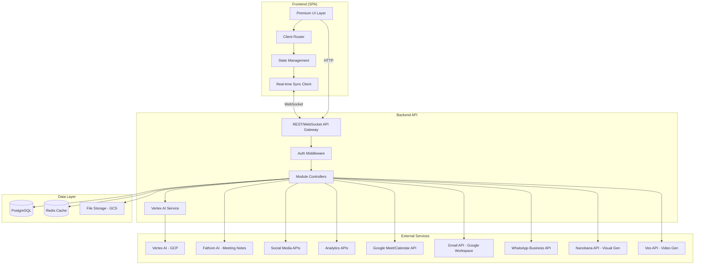
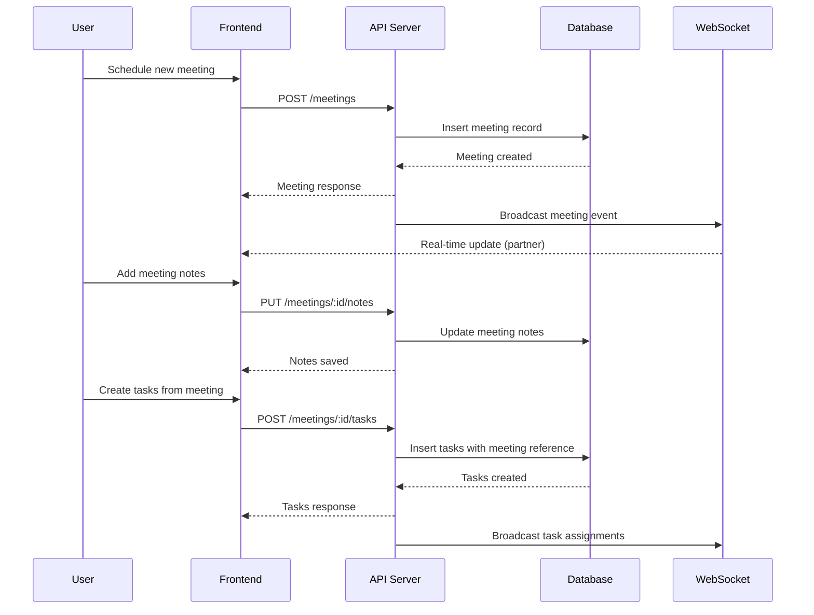
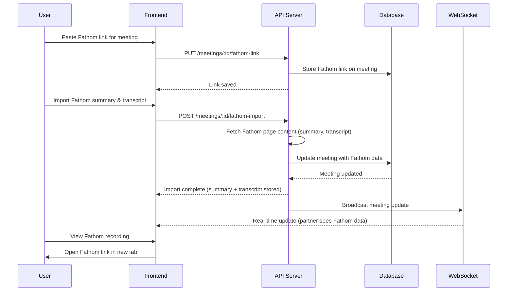
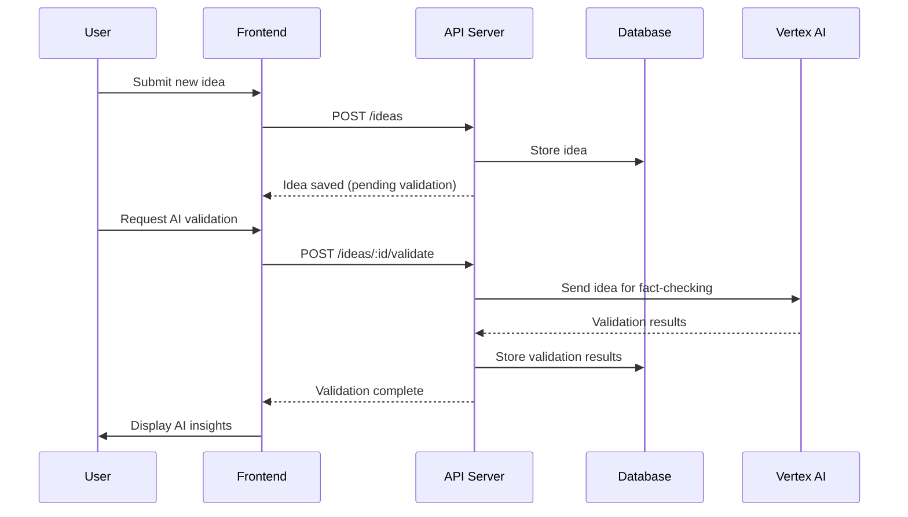
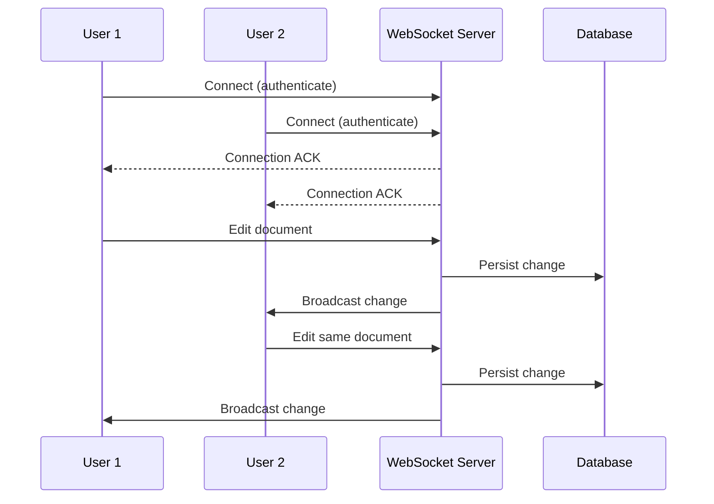
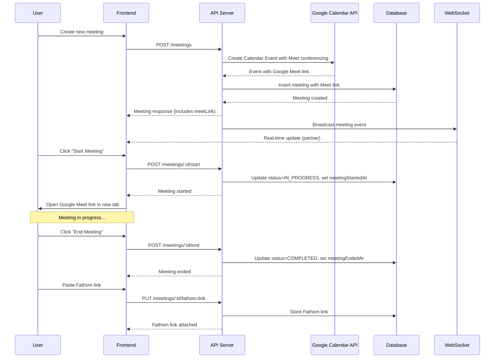
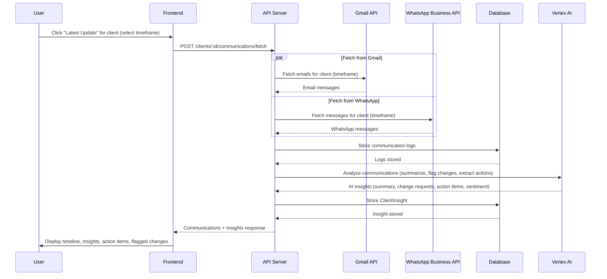
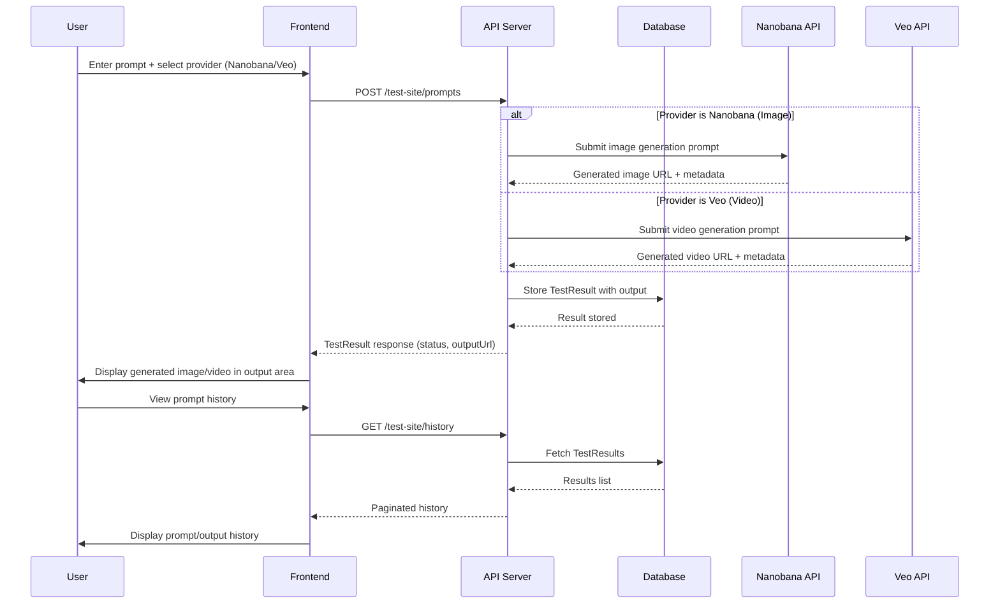
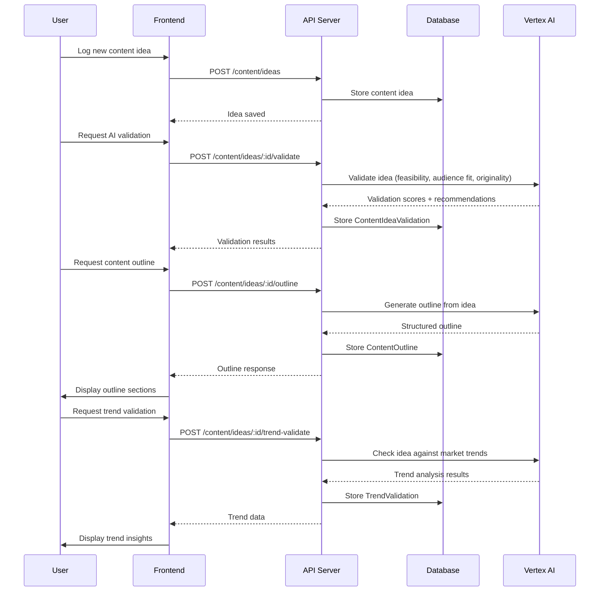

# Design Document: Isocodelabs Ops Hub

## Overview

The Isocodelabs Ops Hub is an internal operations management web application designed for a two-person team managing multiple digital products. It consolidates meetings, task management, client projects, CRM, content planning, ideas validation, analytics dashboards, and shared workspace into a single premium-looking platform.

The application follows a modular monolith architecture with a clean separation between frontend and backend. The frontend delivers an Apple-inspired premium UI/UX with smooth animations, generous whitespace, and elegant typography. The backend exposes a unified API layer that orchestrates all modules while integrating with Vertex AI on GCP for idea validation and fact-checking.

Given the small team size (2 users), the system prioritizes developer experience, fast iteration, and real-time collaboration over horizontal scalability. All data lives in a single database with real-time sync capabilities for the shared workspace experience.

## Architecture



## Sequence Diagrams

### Meeting Flow: Schedule → Document → Create Tasks



### Fathom AI Integration: Link Meeting → Import Notes & Transcript



### Ideas Validation with Vertex AI



### Real-time Collaboration



### Google Meet Flow: Create Meeting → Generate Link → Start → End → Attach Fathom



### Communication Insight Generation: Fetch Comms → AI Analysis → Display Insights



### Test Site Prompt Flow: Submit Prompt → Generate → Display Result



### Content Idea Validation with AI



## Components and Interfaces

### Component 1: Authentication & User Management

**Purpose**: Handle user authentication for the 2-person team with session management.

```pascal
INTERFACE AuthService
  PROCEDURE login(email: String, password: String): AuthResult
  PROCEDURE logout(sessionId: UUID): Void
  PROCEDURE refreshToken(refreshToken: String): TokenPair
  PROCEDURE getCurrentUser(token: String): User
END INTERFACE
```

**Responsibilities**:
- Authenticate users via email/password
- Manage JWT tokens with refresh capability
- Enforce 2-user limit
- Track active sessions

### Component 2: Meetings Module

**Purpose**: Full lifecycle management of meetings from scheduling through documentation to task creation.

```pascal
INTERFACE MeetingService
  PROCEDURE createMeeting(data: MeetingInput): Meeting
  PROCEDURE updateMeeting(id: UUID, data: MeetingUpdate): Meeting
  PROCEDURE getMeeting(id: UUID): Meeting
  PROCEDURE listMeetings(filters: MeetingFilters): PaginatedList<Meeting>
  PROCEDURE addNotes(meetingId: UUID, notes: RichText): Meeting
  PROCEDURE createTasksFromMeeting(meetingId: UUID, tasks: TaskInput[]): Task[]
  PROCEDURE linkFathom(meetingId: UUID, fathomLink: String): Meeting
  PROCEDURE importFathomData(meetingId: UUID): Meeting
  PROCEDURE getFathomSummary(meetingId: UUID): FathomSummary
  PROCEDURE generateGoogleMeetLink(meetingId: UUID): Meeting
  PROCEDURE startMeeting(meetingId: UUID): Meeting
  PROCEDURE endMeeting(meetingId: UUID): Meeting
  PROCEDURE deleteMeeting(id: UUID): Void
END INTERFACE
```

**Responsibilities**:
- Schedule meetings with date, time, agenda
- Document meeting notes with rich text
- Link tasks to originating meetings
- Track meeting history and outcomes
- Generate Google Meet links via Google Calendar API on meeting creation
- One-click "Start Meeting" opens Google Meet and marks meeting as IN_PROGRESS
- Track meeting start/end times for duration logging
- After meeting ends, attach Fathom link for recording/summary
- Store Fathom AI recording links for meeting playback
- Import and persist Fathom-generated summaries and full transcripts
- Provide access to Fathom meeting intelligence alongside manual notes

### Component 3: Task Management Module

**Purpose**: Task creation, assignment, tracking, and completion for the two-person team.

```pascal
INTERFACE TaskService
  PROCEDURE createTask(data: TaskInput): Task
  PROCEDURE updateTask(id: UUID, data: TaskUpdate): Task
  PROCEDURE assignTask(taskId: UUID, userId: UUID): Task
  PROCEDURE updateStatus(taskId: UUID, status: TaskStatus): Task
  PROCEDURE listTasks(filters: TaskFilters): PaginatedList<Task>
  PROCEDURE getTasksByMeeting(meetingId: UUID): Task[]
  PROCEDURE getTasksByProject(projectId: UUID): Task[]
  PROCEDURE deleteTask(id: UUID): Void
END INTERFACE
```

**Responsibilities**:
- Create tasks with title, description, priority, due date
- Assign tasks to team members
- Track task status through workflow states
- Link tasks to meetings and projects
- Filter and sort tasks by various criteria

### Component 4: Client Projects Module

**Purpose**: Manage ongoing client projects with status tracking and deliverables.

```pascal
INTERFACE ProjectService
  PROCEDURE createProject(data: ProjectInput): Project
  PROCEDURE updateProject(id: UUID, data: ProjectUpdate): Project
  PROCEDURE getProject(id: UUID): ProjectDetail
  PROCEDURE listProjects(filters: ProjectFilters): PaginatedList<Project>
  PROCEDURE addMilestone(projectId: UUID, data: MilestoneInput): Milestone
  PROCEDURE updateMilestone(milestoneId: UUID, data: MilestoneUpdate): Milestone
  PROCEDURE linkTaskToProject(taskId: UUID, projectId: UUID): Void
  PROCEDURE getProjectTimeline(projectId: UUID): Timeline
END INTERFACE
```

**Responsibilities**:
- Track project lifecycle from inception to completion
- Manage milestones and deliverables
- Link tasks and team effort to projects
- Provide project timeline visualization

### Component 5: Client Management & Acquisition (CRM)

**Purpose**: CRM-like functionality for managing existing clients and tracking acquisition pipeline.

```pascal
INTERFACE ClientService
  PROCEDURE createClient(data: ClientInput): Client
  PROCEDURE updateClient(id: UUID, data: ClientUpdate): Client
  PROCEDURE getClient(id: UUID): ClientDetail
  PROCEDURE listClients(filters: ClientFilters): PaginatedList<Client>
  PROCEDURE addInteraction(clientId: UUID, data: InteractionInput): Interaction
  PROCEDURE updatePipelineStage(clientId: UUID, stage: PipelineStage): Client
  PROCEDURE getAcquisitionPipeline(): PipelineView
  PROCEDURE getClientHistory(clientId: UUID): Interaction[]
  PROCEDURE connectGmail(clientId: UUID, emailAddress: String): Client
  PROCEDURE connectWhatsApp(clientId: UUID, phoneNumber: String): Client
  PROCEDURE fetchCommunications(clientId: UUID, timeframe: DateRange): CommunicationLog[]
  PROCEDURE generateCommunicationInsights(clientId: UUID, timeframe: DateRange): ClientInsight
  PROCEDURE getClientTimeline(clientId: UUID): TimelineEntry[]
  PROCEDURE addManualLog(clientId: UUID, data: ManualLogInput): CommunicationLog
  PROCEDURE getDailyDigest(clientId: UUID, date: DateTime): ClientInsight
  PROCEDURE getWeeklyDigest(clientId: UUID, weekStart: DateTime): ClientInsight
  PROCEDURE disconnectGmail(clientId: UUID): Client
  PROCEDURE disconnectWhatsApp(clientId: UUID): Client
END INTERFACE
```

**Responsibilities**:
- Store client contact information and details
- Track acquisition pipeline stages
- Log all client interactions
- Manage client relationships over time
- Connect Gmail accounts to automatically track email communications
- Connect WhatsApp Business accounts to track message threads
- Fetch and display communications for a selected timeframe ("Latest Update" feature)
- Generate AI-powered insights via Vertex AI: summarize comms, flag change requests, highlight action items
- Produce daily/weekly digests with email counts, key topics, and sentiment analysis
- Support manual log entries (notes about conversations, calls, requirements)
- Build a unified timeline per client combining automated and manual logs
- Track requirement changes mentioned in communications

### Component 6: Content Management Module

**Purpose**: Plan and manage content across all digital products.

```pascal
INTERFACE ContentService
  PROCEDURE createContent(data: ContentInput): ContentItem
  PROCEDURE updateContent(id: UUID, data: ContentUpdate): ContentItem
  PROCEDURE getContent(id: UUID): ContentItem
  PROCEDURE listContent(filters: ContentFilters): PaginatedList<ContentItem>
  PROCEDURE scheduleContent(id: UUID, publishDate: DateTime): ContentItem
  PROCEDURE getContentCalendar(range: DateRange): CalendarView
  PROCEDURE getContentByProduct(productId: UUID): ContentItem[]
  PROCEDURE logContentIdea(data: ContentIdeaInput): ContentIdea
  PROCEDURE validateContentIdea(ideaId: UUID): ContentIdeaValidation
  PROCEDURE buildContentOutline(ideaId: UUID): ContentOutline
  PROCEDURE getDevelopmentSuggestions(ideaId: UUID): DevelopmentSuggestion[]
  PROCEDURE validateTrend(ideaId: UUID): TrendValidation
  PROCEDURE listContentIdeas(filters: ContentIdeaFilters): PaginatedList<ContentIdea>
  PROCEDURE updateContentIdea(ideaId: UUID, data: ContentIdeaUpdate): ContentIdea
END INTERFACE
```

**Responsibilities**:
- Create and manage content items (blog posts, social media, etc.)
- Schedule content publication dates
- Provide calendar view of content pipeline
- Organize content by digital product
- Log content ideas within the content module
- Validate content ideas via Vertex AI (feasibility, audience fit)
- Fast-build content outlines and drafts using AI
- Provide development suggestions for content pieces
- Validate ideas against current market trends

### Component 7: Ideas Management Module

**Purpose**: Capture product ideas and validate them using Vertex AI.

```pascal
INTERFACE IdeaService
  PROCEDURE createIdea(data: IdeaInput): Idea
  PROCEDURE updateIdea(id: UUID, data: IdeaUpdate): Idea
  PROCEDURE getIdea(id: UUID): IdeaDetail
  PROCEDURE listIdeas(filters: IdeaFilters): PaginatedList<Idea>
  PROCEDURE validateIdea(id: UUID): AIValidationResult
  PROCEDURE factCheck(id: UUID, claims: String[]): FactCheckResult
  PROCEDURE getValidationHistory(id: UUID): AIValidationResult[]
  PROCEDURE categorizeIdea(id: UUID, categories: String[]): Idea
END INTERFACE
```

**Responsibilities**:
- Capture ideas with description, context, potential impact
- Integrate with Vertex AI for validation and fact-checking
- Store AI validation history for reference
- Categorize and prioritize ideas

### Component 8: Dashboard Module

**Purpose**: Aggregate analytics from social media accounts and website analytics.

```pascal
INTERFACE DashboardService
  PROCEDURE getDashboardOverview(): DashboardData
  PROCEDURE getSocialMediaMetrics(accounts: String[]): SocialMetrics
  PROCEDURE getWebsiteAnalytics(siteIds: String[]): WebAnalytics
  PROCEDURE addTrackedAccount(data: AccountInput): TrackedAccount
  PROCEDURE removeTrackedAccount(id: UUID): Void
  PROCEDURE refreshMetrics(source: MetricSource): RefreshResult
  PROCEDURE getMetricHistory(source: MetricSource, range: DateRange): MetricHistory
END INTERFACE
```

**Responsibilities**:
- Aggregate social media metrics
- Pull website analytics data
- Provide unified dashboard view
- Support multiple tracked accounts/sites

### Component 9: Shared Workspace Module

**Purpose**: Collaborative workspace with real-time editing for notes, documents, and shared resources.

```pascal
INTERFACE WorkspaceService
  PROCEDURE createPage(data: PageInput): Page
  PROCEDURE updatePage(id: UUID, data: PageUpdate): Page
  PROCEDURE getPage(id: UUID): Page
  PROCEDURE listPages(filters: PageFilters): PaginatedList<Page>
  PROCEDURE createFolder(data: FolderInput): Folder
  PROCEDURE movePage(pageId: UUID, targetFolderId: UUID): Page
  PROCEDURE searchPages(query: String): SearchResult[]
  PROCEDURE getRecentPages(): Page[]
END INTERFACE
```

**Responsibilities**:
- Create and organize pages in folders
- Real-time collaborative editing via WebSocket
- Rich text editing with blocks (text, code, images, embeds)
- Search across all workspace content
- Track page history and revisions

### Component 10: Real-time Collaboration Engine

**Purpose**: Handle WebSocket connections and real-time synchronization between the two users.

```pascal
INTERFACE RealtimeService
  PROCEDURE connect(userId: UUID, token: String): Connection
  PROCEDURE disconnect(connectionId: UUID): Void
  PROCEDURE broadcast(channel: String, event: Event): Void
  PROCEDURE subscribe(connectionId: UUID, channel: String): Subscription
  PROCEDURE unsubscribe(connectionId: UUID, channel: String): Void
  PROCEDURE getPresence(): PresenceInfo
END INTERFACE
```

**Responsibilities**:
- Manage WebSocket connections for both users
- Broadcast real-time updates across modules
- Track user presence and activity
- Handle conflict resolution for concurrent edits

### Component 11: Test Site Module

**Purpose**: Dedicated testing environment for visual and video generation using Nanobana and Veo APIs before building things out.

```pascal
INTERFACE TestSiteService
  PROCEDURE submitPrompt(data: TestPromptInput): TestResult
  PROCEDURE getTestResult(id: UUID): TestResult
  PROCEDURE listTestHistory(filters: TestHistoryFilters): PaginatedList<TestResult>
  PROCEDURE retryPrompt(id: UUID): TestResult
  PROCEDURE deleteTestResult(id: UUID): Void
  PROCEDURE getPromptSuggestions(context: String): String[]
END INTERFACE
```

**Responsibilities**:
- Accept prompt input from users for visual/video generation
- Route prompts to either Nanobana (image generation) or Veo (video generation)
- Display generated results (images, videos) in output area
- Maintain history of all prompts and outputs
- Allow retry with modified prompts
- Preview how things look before full implementation

### Component 12: Communication Tracking Engine

**Purpose**: Orchestrate email and WhatsApp communication fetching, AI analysis, and timeline building for client communications.

```pascal
INTERFACE CommunicationTrackingService
  PROCEDURE syncGmailMessages(clientId: UUID, timeframe: DateRange): SyncResult
  PROCEDURE syncWhatsAppMessages(clientId: UUID, timeframe: DateRange): SyncResult
  PROCEDURE buildClientTimeline(clientId: UUID): TimelineEntry[]
  PROCEDURE generateDigest(clientId: UUID, type: DigestType, timeframe: DateRange): ClientInsight
  PROCEDURE flagChangeRequests(communications: CommunicationLog[]): CommunicationLog[]
  PROCEDURE extractActionItems(communications: CommunicationLog[]): String[]
  PROCEDURE analyzeSentiment(communications: CommunicationLog[]): SentimentResult
END INTERFACE
```

**Responsibilities**:
- Sync emails from connected Gmail accounts via Google Workspace APIs
- Sync messages from connected WhatsApp Business accounts
- Build unified timeline combining automated + manual logs
- Generate daily/weekly digests with Vertex AI
- Flag communications containing change requests
- Extract action items from message content
- Perform sentiment analysis on communication threads

## Data Models

### User

```pascal
STRUCTURE User
  id: UUID
  email: String
  name: String
  avatarUrl: String (nullable)
  role: Enum(ADMIN, MEMBER)
  createdAt: DateTime
  updatedAt: DateTime
END STRUCTURE
```

**Validation Rules**:
- Email must be valid format and unique
- Name must be 1-100 characters
- Maximum 2 users in the system

### Meeting

```pascal
STRUCTURE Meeting
  id: UUID
  title: String
  description: String (nullable)
  agenda: RichText (nullable)
  notes: RichText (nullable)
  scheduledAt: DateTime
  duration: Integer (minutes)
  status: Enum(SCHEDULED, IN_PROGRESS, COMPLETED, CANCELLED)
  attendees: UUID[] (user IDs)
  googleMeetLink: String (nullable)
  googleCalendarEventId: String (nullable)
  meetingStartedAt: DateTime (nullable)
  meetingEndedAt: DateTime (nullable)
  fathomLink: String (nullable)
  fathomSummary: String (nullable)
  fathomTranscript: String (nullable)
  fathomImportedAt: DateTime (nullable)
  createdBy: UUID
  createdAt: DateTime
  updatedAt: DateTime
END STRUCTURE
```

**Validation Rules**:
- Title must be 1-200 characters
- Duration must be positive integer (1-480 minutes)
- ScheduledAt must be a valid future or present datetime
- Attendees must reference valid user IDs
- googleMeetLink must be a valid Google Meet URL (https://meet.google.com/*) if provided
- googleCalendarEventId references the Google Calendar event used to generate the Meet link
- meetingEndedAt must be after meetingStartedAt if both are set
- fathomLink must be a valid URL matching Fathom domain (e.g., fathom.video/*) if provided
- fathomSummary and fathomTranscript are only populated after successful Fathom import
- fathomImportedAt is set when Fathom data is imported and must not precede meeting's createdAt

### Task

```pascal
STRUCTURE Task
  id: UUID
  title: String
  description: String (nullable)
  status: Enum(TODO, IN_PROGRESS, IN_REVIEW, DONE)
  priority: Enum(LOW, MEDIUM, HIGH, URGENT)
  assigneeId: UUID (nullable)
  dueDate: DateTime (nullable)
  meetingId: UUID (nullable)
  projectId: UUID (nullable)
  tags: String[]
  createdBy: UUID
  createdAt: DateTime
  updatedAt: DateTime
END STRUCTURE
```

**Validation Rules**:
- Title must be 1-300 characters
- AssigneeId must reference valid user
- DueDate must be in the future when set
- Tags limited to 10 per task

### Client

```pascal
STRUCTURE Client
  id: UUID
  name: String
  email: String (nullable)
  phone: String (nullable)
  company: String (nullable)
  pipelineStage: Enum(LEAD, CONTACTED, PROPOSAL, NEGOTIATION, ACTIVE, CHURNED)
  notes: String (nullable)
  source: String (nullable)
  value: Decimal (nullable)
  connectedGmail: String (nullable)
  connectedWhatsApp: String (nullable)
  lastCommunicationAt: DateTime (nullable)
  communicationSummary: String (nullable)
  totalEmails: Integer (default: 0)
  totalWhatsAppMessages: Integer (default: 0)
  createdBy: UUID
  createdAt: DateTime
  updatedAt: DateTime
END STRUCTURE

STRUCTURE Interaction
  id: UUID
  clientId: UUID
  type: Enum(EMAIL, CALL, MEETING, NOTE, OTHER)
  summary: String
  details: RichText (nullable)
  date: DateTime
  createdBy: UUID
  createdAt: DateTime
END STRUCTURE

STRUCTURE CommunicationLog
  id: UUID
  clientId: UUID
  source: Enum(GMAIL, WHATSAPP, MANUAL)
  direction: Enum(INBOUND, OUTBOUND)
  subject: String (nullable)
  body: String
  senderEmail: String (nullable)
  senderPhone: String (nullable)
  receivedAt: DateTime
  threadId: String (nullable)
  messageId: String (nullable)
  attachments: String[] (nullable)
  sentiment: Enum(POSITIVE, NEUTRAL, NEGATIVE) (nullable)
  flaggedAsChangeRequest: Boolean (default: false)
  actionItems: String[] (nullable)
  createdAt: DateTime
END STRUCTURE

STRUCTURE ClientInsight
  id: UUID
  clientId: UUID
  type: Enum(DAILY_DIGEST, WEEKLY_DIGEST, COMMUNICATION_SUMMARY, CHANGE_REQUEST_FLAG, ACTION_ITEMS)
  timeframeStart: DateTime
  timeframeEnd: DateTime
  summary: String
  keyTopics: String[]
  sentimentOverview: Enum(POSITIVE, NEUTRAL, NEGATIVE, MIXED)
  emailCount: Integer
  whatsappCount: Integer
  manualLogCount: Integer
  actionItems: String[]
  changeRequests: String[]
  generatedBy: String (model identifier)
  createdAt: DateTime
END STRUCTURE
```

**Validation Rules**:
- Client name must be 1-200 characters
- Email must be valid format if provided
- Value must be non-negative if provided
- Interaction summary must be 1-500 characters
- CommunicationLog body must be non-empty
- CommunicationLog receivedAt must not be in the future
- ClientInsight timeframeEnd must be after timeframeStart
- ClientInsight emailCount, whatsappCount, manualLogCount must be non-negative
- connectedGmail must be a valid email if provided
- connectedWhatsApp must be a valid phone number if provided

### Project

```pascal
STRUCTURE Project
  id: UUID
  name: String
  description: String (nullable)
  clientId: UUID (nullable)
  status: Enum(PLANNING, ACTIVE, ON_HOLD, COMPLETED, CANCELLED)
  startDate: DateTime (nullable)
  endDate: DateTime (nullable)
  budget: Decimal (nullable)
  createdBy: UUID
  createdAt: DateTime
  updatedAt: DateTime
END STRUCTURE

STRUCTURE Milestone
  id: UUID
  projectId: UUID
  title: String
  description: String (nullable)
  dueDate: DateTime (nullable)
  status: Enum(PENDING, IN_PROGRESS, COMPLETED)
  createdAt: DateTime
  updatedAt: DateTime
END STRUCTURE
```

**Validation Rules**:
- Project name must be 1-200 characters
- EndDate must be after StartDate if both provided
- Budget must be non-negative if provided

### Content Item

```pascal
STRUCTURE ContentItem
  id: UUID
  title: String
  body: RichText (nullable)
  type: Enum(BLOG_POST, SOCIAL_MEDIA, VIDEO, NEWSLETTER, OTHER)
  status: Enum(IDEA, DRAFT, IN_REVIEW, SCHEDULED, PUBLISHED)
  productId: UUID (nullable)
  publishDate: DateTime (nullable)
  platforms: String[]
  tags: String[]
  createdBy: UUID
  createdAt: DateTime
  updatedAt: DateTime
END STRUCTURE
```

**Validation Rules**:
- Title must be 1-300 characters
- PublishDate must be future when status is SCHEDULED
- Platforms limited to known platform identifiers

### Idea

```pascal
STRUCTURE Idea
  id: UUID
  title: String
  description: RichText
  category: Enum(PRODUCT, FEATURE, CONTENT, BUSINESS, OTHER)
  status: Enum(RAW, VALIDATED, APPROVED, REJECTED, IMPLEMENTED)
  impact: Enum(LOW, MEDIUM, HIGH) (nullable)
  effort: Enum(LOW, MEDIUM, HIGH) (nullable)
  aiValidations: AIValidationResult[]
  tags: String[]
  createdBy: UUID
  createdAt: DateTime
  updatedAt: DateTime
END STRUCTURE

STRUCTURE AIValidationResult
  id: UUID
  ideaId: UUID
  type: Enum(FACT_CHECK, MARKET_VALIDATION, FEASIBILITY, GENERAL)
  prompt: String
  response: String
  confidence: Float (0.0 - 1.0)
  claims: ClaimResult[]
  createdAt: DateTime
END STRUCTURE

STRUCTURE ClaimResult
  claim: String
  isValid: Boolean
  explanation: String
  sources: String[]
END STRUCTURE
```

**Validation Rules**:
- Idea title must be 1-300 characters
- Description must not be empty
- Confidence must be between 0.0 and 1.0

### Workspace Page

```pascal
STRUCTURE Page
  id: UUID
  title: String
  content: Block[]
  folderId: UUID (nullable)
  icon: String (nullable)
  coverImage: String (nullable)
  lastEditedBy: UUID
  createdBy: UUID
  createdAt: DateTime
  updatedAt: DateTime
END STRUCTURE

STRUCTURE Block
  id: UUID
  type: Enum(TEXT, HEADING, LIST, CODE, IMAGE, EMBED, DIVIDER, TABLE)
  content: JSON
  order: Integer
END STRUCTURE

STRUCTURE Folder
  id: UUID
  name: String
  parentId: UUID (nullable)
  icon: String (nullable)
  createdAt: DateTime
  updatedAt: DateTime
END STRUCTURE
```

**Validation Rules**:
- Page title must be 1-300 characters
- Block order must be unique within a page
- Folder nesting limited to 5 levels deep

### Content Idea

```pascal
STRUCTURE ContentIdea
  id: UUID
  title: String
  description: RichText
  contentType: Enum(BLOG_POST, SOCIAL_MEDIA, VIDEO, NEWSLETTER, OTHER)
  targetAudience: String (nullable)
  status: Enum(RAW, VALIDATING, VALIDATED, OUTLINED, IN_DEVELOPMENT, REJECTED)
  aiValidation: ContentIdeaValidation (nullable)
  outline: ContentOutline (nullable)
  developmentSuggestions: DevelopmentSuggestion[] (nullable)
  trendValidation: TrendValidation (nullable)
  tags: String[]
  createdBy: UUID
  createdAt: DateTime
  updatedAt: DateTime
END STRUCTURE

STRUCTURE ContentIdeaValidation
  id: UUID
  ideaId: UUID
  feasibilityScore: Float (0.0 - 1.0)
  audienceFitScore: Float (0.0 - 1.0)
  originalityScore: Float (0.0 - 1.0)
  overallScore: Float (0.0 - 1.0)
  strengths: String[]
  weaknesses: String[]
  recommendations: String[]
  generatedBy: String (model identifier)
  createdAt: DateTime
END STRUCTURE

STRUCTURE ContentOutline
  id: UUID
  ideaId: UUID
  sections: OutlineSection[]
  estimatedWordCount: Integer
  estimatedReadTime: Integer (minutes)
  generatedBy: String (model identifier)
  createdAt: DateTime
END STRUCTURE

STRUCTURE OutlineSection
  title: String
  keyPoints: String[]
  order: Integer
END STRUCTURE

STRUCTURE DevelopmentSuggestion
  id: UUID
  ideaId: UUID
  category: Enum(FORMAT, ANGLE, DISTRIBUTION, TIMING, COLLABORATION)
  suggestion: String
  rationale: String
  priority: Enum(LOW, MEDIUM, HIGH)
  createdAt: DateTime
END STRUCTURE

STRUCTURE TrendValidation
  id: UUID
  ideaId: UUID
  isTrending: Boolean
  trendScore: Float (0.0 - 1.0)
  relatedTrends: String[]
  marketInsights: String[]
  competitorContent: String[]
  recommendedTiming: String (nullable)
  generatedBy: String (model identifier)
  createdAt: DateTime
END STRUCTURE
```

**Validation Rules**:
- ContentIdea title must be 1-300 characters
- ContentIdea description must not be empty
- All scores (feasibility, audience fit, originality, overall, trend) must be between 0.0 and 1.0
- OutlineSection order must be unique within an outline
- estimatedWordCount must be positive
- estimatedReadTime must be positive

### Test Site Result

```pascal
STRUCTURE TestResult
  id: UUID
  provider: Enum(NANOBANA, VEO)
  prompt: String
  parameters: JSON (nullable)
  status: Enum(PENDING, PROCESSING, COMPLETED, FAILED)
  outputType: Enum(IMAGE, VIDEO) (nullable)
  outputUrl: String (nullable)
  outputMetadata: JSON (nullable)
  errorMessage: String (nullable)
  processingTime: Integer (milliseconds, nullable)
  createdBy: UUID
  createdAt: DateTime
  completedAt: DateTime (nullable)
END STRUCTURE
```

**Validation Rules**:
- Prompt must be 1-2000 characters
- Provider must be either NANOBANA or VEO
- outputUrl must be a valid URL if provided
- completedAt must be after createdAt if provided
- outputType must be IMAGE when provider is NANOBANA
- outputType must be VIDEO when provider is VEO
- processingTime must be non-negative if provided

## Algorithmic Pseudocode

### Main Authentication Algorithm

```pascal
ALGORITHM authenticateUser(email, password)
INPUT: email of type String, password of type String
OUTPUT: authResult of type AuthResult

BEGIN
  ASSERT email IS NOT EMPTY
  ASSERT password IS NOT EMPTY

  user ← database.findUserByEmail(email)

  IF user IS NULL THEN
    RETURN AuthResult.Error("Invalid credentials")
  END IF

  passwordValid ← verifyHash(password, user.passwordHash)

  IF NOT passwordValid THEN
    RETURN AuthResult.Error("Invalid credentials")
  END IF

  accessToken ← generateJWT(user, expiresIn: 15 minutes)
  refreshToken ← generateRefreshToken(user, expiresIn: 7 days)

  session ← createSession(user.id, refreshToken)
  database.storeSession(session)

  RETURN AuthResult.Success(accessToken, refreshToken)
END
```

**Preconditions:**
- Email is a non-empty, well-formed email string
- Password is a non-empty string

**Postconditions:**
- If successful: returns valid token pair and creates session
- If failed: returns error without creating session
- No password is stored or logged in plaintext

### Task Creation from Meeting Algorithm

```pascal
ALGORITHM createTasksFromMeeting(meetingId, taskInputs)
INPUT: meetingId of type UUID, taskInputs of type TaskInput[]
OUTPUT: tasks of type Task[]

BEGIN
  ASSERT meetingId IS NOT NULL
  ASSERT taskInputs IS NOT EMPTY

  meeting ← database.findMeeting(meetingId)

  IF meeting IS NULL THEN
    RAISE Error("Meeting not found")
  END IF

  IF meeting.status NOT EQUALS COMPLETED THEN
    RAISE Error("Meeting must be completed before creating tasks")
  END IF

  createdTasks ← EMPTY LIST

  FOR EACH input IN taskInputs DO
    ASSERT input.title IS NOT EMPTY

    task ← NEW Task
    task.id ← generateUUID()
    task.title ← input.title
    task.description ← input.description
    task.priority ← input.priority OR DEFAULT(MEDIUM)
    task.assigneeId ← input.assigneeId
    task.dueDate ← input.dueDate
    task.meetingId ← meetingId
    task.projectId ← input.projectId
    task.status ← TODO
    task.createdBy ← getCurrentUser().id
    task.createdAt ← NOW()
    task.updatedAt ← NOW()

    database.insertTask(task)
    createdTasks.add(task)
  END FOR

  broadcastEvent("tasks.created", { meetingId, tasks: createdTasks })

  RETURN createdTasks
END
```

**Preconditions:**
- meetingId references an existing meeting
- taskInputs is a non-empty array of valid task inputs
- Current user is authenticated

**Postconditions:**
- All tasks are created and persisted
- Each task references the source meeting
- Real-time event is broadcast to other user
- Returns all created tasks

**Loop Invariants:**
- All previously created tasks in createdTasks are persisted in database
- Each task has a unique UUID

### Fathom AI Data Import Algorithm

```pascal
ALGORITHM importFathomData(meetingId)
INPUT: meetingId of type UUID
OUTPUT: updatedMeeting of type Meeting

BEGIN
  ASSERT meetingId IS NOT NULL

  meeting ← database.findMeeting(meetingId)

  IF meeting IS NULL THEN
    RAISE Error("Meeting not found")
  END IF

  IF meeting.fathomLink IS NULL OR meeting.fathomLink IS EMPTY THEN
    RAISE Error("No Fathom link associated with this meeting")
  END IF

  // Validate Fathom link format
  IF NOT isValidFathomUrl(meeting.fathomLink) THEN
    RAISE Error("Invalid Fathom link format")
  END IF

  // Fetch Fathom data (manual paste workflow — user copies summary & transcript)
  // Note: Fathom does not provide a public API; data is entered manually
  // or parsed from the shared Fathom page if accessible
  fathomData ← fetchFathomPageContent(meeting.fathomLink)

  IF fathomData IS NULL THEN
    RAISE Error("Unable to retrieve Fathom data from link")
  END IF

  // Update meeting with Fathom data
  meeting.fathomSummary ← fathomData.summary
  meeting.fathomTranscript ← fathomData.transcript
  meeting.fathomImportedAt ← NOW()
  meeting.updatedAt ← NOW()

  database.updateMeeting(meeting)

  broadcastEvent("meeting.fathomImported", { meetingId, importedAt: meeting.fathomImportedAt })

  RETURN meeting
END

FUNCTION isValidFathomUrl(url)
INPUT: url of type String
OUTPUT: isValid of type Boolean

BEGIN
  // Fathom links follow pattern: https://fathom.video/share/...
  pattern ← "^https://(app\\.)?fathom\\.video/"
  RETURN url MATCHES pattern
END
```

**Preconditions:**
- meetingId references an existing meeting
- Meeting has a non-empty fathomLink field
- Fathom link is a valid and accessible URL

**Postconditions:**
- Meeting record is updated with summary and transcript from Fathom
- fathomImportedAt timestamp is set
- Real-time event is broadcast to partner
- Original meeting notes (manual) are not overwritten
- fathomLink remains unchanged

**Loop Invariants:** N/A

### Vertex AI Idea Validation Algorithm

```pascal
ALGORITHM validateIdea(ideaId)
INPUT: ideaId of type UUID
OUTPUT: validationResult of type AIValidationResult

BEGIN
  ASSERT ideaId IS NOT NULL

  idea ← database.findIdea(ideaId)

  IF idea IS NULL THEN
    RAISE Error("Idea not found")
  END IF

  // Build validation prompt
  prompt ← buildValidationPrompt(idea)

  // Call Vertex AI
  aiResponse ← vertexAI.generateContent(
    model: "gemini-pro",
    prompt: prompt,
    parameters: {
      temperature: 0.3,
      maxOutputTokens: 2048
    }
  )

  // Parse structured response
  parsedResult ← parseAIResponse(aiResponse)

  // Extract claims and validate each
  claims ← extractClaims(idea.description)
  claimResults ← EMPTY LIST

  FOR EACH claim IN claims DO
    factCheckPrompt ← buildFactCheckPrompt(claim)
    factResponse ← vertexAI.generateContent(
      model: "gemini-pro",
      prompt: factCheckPrompt,
      parameters: { temperature: 0.1, maxOutputTokens: 1024 }
    )
    claimResult ← parseClaimResponse(factResponse)
    claimResults.add(claimResult)
  END FOR

  // Compute overall confidence
  validCount ← COUNT(claimResults WHERE isValid EQUALS TRUE)
  confidence ← validCount / LENGTH(claimResults)

  // Store result
  validationResult ← NEW AIValidationResult
  validationResult.id ← generateUUID()
  validationResult.ideaId ← ideaId
  validationResult.type ← GENERAL
  validationResult.prompt ← prompt
  validationResult.response ← aiResponse.text
  validationResult.confidence ← confidence
  validationResult.claims ← claimResults
  validationResult.createdAt ← NOW()

  database.insertValidation(validationResult)

  RETURN validationResult
END
```

**Preconditions:**
- ideaId references an existing idea
- Vertex AI service is available and configured
- GCP credentials are valid

**Postconditions:**
- Validation result is persisted
- Confidence score is between 0.0 and 1.0
- All claims are individually fact-checked
- Original idea record is not mutated

**Loop Invariants:**
- All previously checked claims have results stored in claimResults
- Each claimResult has a valid isValid boolean and explanation

### Real-time Collaboration Sync Algorithm

```pascal
ALGORITHM handleDocumentEdit(connectionId, pageId, operation)
INPUT: connectionId of type UUID, pageId of type UUID, operation of type EditOperation
OUTPUT: syncResult of type SyncResult

BEGIN
  ASSERT connectionId IS NOT NULL
  ASSERT pageId IS NOT NULL
  ASSERT operation IS NOT NULL

  connection ← getConnection(connectionId)

  IF connection IS NULL THEN
    RAISE Error("Connection not found")
  END IF

  page ← database.findPage(pageId)

  IF page IS NULL THEN
    RAISE Error("Page not found")
  END IF

  // Apply operational transform for conflict resolution
  currentVersion ← page.version
  transformedOp ← operationalTransform(operation, currentVersion)

  // Apply the edit
  updatedContent ← applyOperation(page.content, transformedOp)

  // Persist change
  page.content ← updatedContent
  page.version ← currentVersion + 1
  page.lastEditedBy ← connection.userId
  page.updatedAt ← NOW()

  database.updatePage(page)

  // Broadcast to other connected user
  otherConnections ← getSubscribers(pageId) MINUS connectionId

  FOR EACH otherId IN otherConnections DO
    sendEvent(otherId, "page.updated", {
      pageId: pageId,
      operation: transformedOp,
      version: page.version,
      editedBy: connection.userId
    })
  END FOR

  RETURN SyncResult.Success(page.version)
END
```

**Preconditions:**
- Connection is authenticated and active
- Page exists and user has edit access
- Operation is a valid edit operation

**Postconditions:**
- Page content is updated and persisted
- Page version is incremented by exactly 1
- All other subscribers receive the update
- No data loss from concurrent edits (operational transform)

**Loop Invariants:**
- All previously notified connections have received the event

### Client Pipeline Progression Algorithm

```pascal
ALGORITHM updateClientPipelineStage(clientId, newStage)
INPUT: clientId of type UUID, newStage of type PipelineStage
OUTPUT: updatedClient of type Client

BEGIN
  ASSERT clientId IS NOT NULL
  ASSERT newStage IS VALID PipelineStage

  client ← database.findClient(clientId)

  IF client IS NULL THEN
    RAISE Error("Client not found")
  END IF

  // Validate stage transition
  validTransitions ← getValidTransitions(client.pipelineStage)

  IF newStage NOT IN validTransitions THEN
    RAISE Error("Invalid pipeline stage transition")
  END IF

  previousStage ← client.pipelineStage
  client.pipelineStage ← newStage
  client.updatedAt ← NOW()

  database.updateClient(client)

  // Log the stage change as interaction
  interaction ← NEW Interaction
  interaction.id ← generateUUID()
  interaction.clientId ← clientId
  interaction.type ← NOTE
  interaction.summary ← "Pipeline stage changed: " + previousStage + " → " + newStage
  interaction.date ← NOW()
  interaction.createdBy ← getCurrentUser().id
  interaction.createdAt ← NOW()

  database.insertInteraction(interaction)

  broadcastEvent("client.stageChanged", { clientId, previousStage, newStage })

  RETURN client
END

FUNCTION getValidTransitions(currentStage)
INPUT: currentStage of type PipelineStage
OUTPUT: validStages of type PipelineStage[]

BEGIN
  MATCH currentStage WITH
    LEAD: RETURN [CONTACTED, CHURNED]
    CONTACTED: RETURN [PROPOSAL, CHURNED]
    PROPOSAL: RETURN [NEGOTIATION, CONTACTED, CHURNED]
    NEGOTIATION: RETURN [ACTIVE, PROPOSAL, CHURNED]
    ACTIVE: RETURN [CHURNED]
    CHURNED: RETURN [LEAD]
  END MATCH
END
```

**Preconditions:**
- clientId references an existing client
- newStage is a valid PipelineStage enum value
- Current user is authenticated

**Postconditions:**
- Client stage is updated only if transition is valid
- Stage change is logged as an interaction
- Real-time event is broadcast
- Returns updated client

### Content Scheduling Algorithm

```pascal
ALGORITHM scheduleContent(contentId, publishDate)
INPUT: contentId of type UUID, publishDate of type DateTime
OUTPUT: scheduledContent of type ContentItem

BEGIN
  ASSERT contentId IS NOT NULL
  ASSERT publishDate IS NOT NULL
  ASSERT publishDate > NOW()

  content ← database.findContent(contentId)

  IF content IS NULL THEN
    RAISE Error("Content not found")
  END IF

  IF content.status EQUALS PUBLISHED THEN
    RAISE Error("Cannot schedule already published content")
  END IF

  IF content.body IS EMPTY THEN
    RAISE Error("Cannot schedule content without body")
  END IF

  content.publishDate ← publishDate
  content.status ← SCHEDULED
  content.updatedAt ← NOW()

  database.updateContent(content)

  // Schedule publish job
  scheduler.scheduleJob("content.publish", {
    contentId: contentId,
    executeAt: publishDate
  })

  broadcastEvent("content.scheduled", { contentId, publishDate })

  RETURN content
END
```

**Preconditions:**
- contentId references existing content
- publishDate is in the future
- Content has body text

**Postconditions:**
- Content status is SCHEDULED
- Publish job is scheduled for the specified date
- Content body is not modified
- Event is broadcast to other user

### Google Meet Link Generation Algorithm

```pascal
ALGORITHM generateGoogleMeetLink(meetingId)
INPUT: meetingId of type UUID
OUTPUT: updatedMeeting of type Meeting

BEGIN
  ASSERT meetingId IS NOT NULL

  meeting ← database.findMeeting(meetingId)

  IF meeting IS NULL THEN
    RAISE Error("Meeting not found")
  END IF

  IF meeting.googleMeetLink IS NOT NULL THEN
    RAISE Error("Google Meet link already exists for this meeting")
  END IF

  // Create Google Calendar event with conferencing
  calendarEvent ← googleCalendarAPI.createEvent({
    summary: meeting.title,
    description: meeting.description,
    start: meeting.scheduledAt,
    end: addMinutes(meeting.scheduledAt, meeting.duration),
    attendees: getEmailsForUsers(meeting.attendees),
    conferenceData: {
      createRequest: {
        requestId: meeting.id,
        conferenceSolutionKey: { type: "hangoutsMeet" }
      }
    }
  })

  IF calendarEvent IS NULL OR calendarEvent.conferenceData IS NULL THEN
    RAISE Error("Failed to generate Google Meet link")
  END IF

  meetLink ← calendarEvent.conferenceData.entryPoints[0].uri

  meeting.googleMeetLink ← meetLink
  meeting.googleCalendarEventId ← calendarEvent.id
  meeting.updatedAt ← NOW()

  database.updateMeeting(meeting)

  broadcastEvent("meeting.meetLinkGenerated", { meetingId, meetLink })

  RETURN meeting
END
```

**Preconditions:**
- meetingId references an existing meeting
- Meeting does not already have a Google Meet link
- Google Calendar API credentials are valid and authorized
- Meeting has valid scheduled time and attendees

**Postconditions:**
- Meeting record updated with Google Meet link and Calendar event ID
- Google Calendar event created with Meet conferencing enabled
- Real-time event broadcast to partner
- Original meeting notes and Fathom data are unaffected

### Fetch Client Communications Algorithm

```pascal
ALGORITHM fetchClientCommunications(clientId, timeframe)
INPUT: clientId of type UUID, timeframe of type DateRange
OUTPUT: communications of type CommunicationLog[]

BEGIN
  ASSERT clientId IS NOT NULL
  ASSERT timeframe.start < timeframe.end

  client ← database.findClient(clientId)

  IF client IS NULL THEN
    RAISE Error("Client not found")
  END IF

  allLogs ← EMPTY LIST

  // Fetch Gmail messages if connected
  IF client.connectedGmail IS NOT NULL THEN
    gmailMessages ← gmailAPI.fetchMessages({
      query: "from:" + client.email + " OR to:" + client.email,
      after: timeframe.start,
      before: timeframe.end
    })

    FOR EACH message IN gmailMessages DO
      log ← NEW CommunicationLog
      log.id ← generateUUID()
      log.clientId ← clientId
      log.source ← GMAIL
      log.direction ← determineDirection(message, client.email)
      log.subject ← message.subject
      log.body ← message.body
      log.senderEmail ← message.from
      log.receivedAt ← message.date
      log.threadId ← message.threadId
      log.messageId ← message.messageId
      log.attachments ← message.attachmentNames
      log.createdAt ← NOW()

      allLogs.add(log)
    END FOR
  END IF

  // Fetch WhatsApp messages if connected
  IF client.connectedWhatsApp IS NOT NULL THEN
    whatsappMessages ← whatsappAPI.fetchMessages({
      phoneNumber: client.connectedWhatsApp,
      after: timeframe.start,
      before: timeframe.end
    })

    FOR EACH message IN whatsappMessages DO
      log ← NEW CommunicationLog
      log.id ← generateUUID()
      log.clientId ← clientId
      log.source ← WHATSAPP
      log.direction ← determineDirection(message, client.connectedWhatsApp)
      log.body ← message.text
      log.senderPhone ← message.from
      log.receivedAt ← message.timestamp
      log.messageId ← message.messageId
      log.createdAt ← NOW()

      allLogs.add(log)
    END FOR
  END IF

  // Fetch existing manual logs from database
  manualLogs ← database.findCommunicationLogs(clientId, MANUAL, timeframe)
  allLogs.addAll(manualLogs)

  // Persist new automated logs (deduplicate by messageId)
  FOR EACH log IN allLogs WHERE log.source NOT EQUALS MANUAL DO
    existing ← database.findCommunicationLogByMessageId(log.messageId)
    IF existing IS NULL THEN
      database.insertCommunicationLog(log)
    END IF
  END FOR

  // Sort by receivedAt descending
  allLogs.sortBy(receivedAt, DESCENDING)

  // Update client's lastCommunicationAt
  IF allLogs IS NOT EMPTY THEN
    client.lastCommunicationAt ← allLogs[0].receivedAt
    client.totalEmails ← COUNT(allLogs WHERE source EQUALS GMAIL)
    client.totalWhatsAppMessages ← COUNT(allLogs WHERE source EQUALS WHATSAPP)
    client.updatedAt ← NOW()
    database.updateClient(client)
  END IF

  RETURN allLogs
END
```

**Preconditions:**
- clientId references an existing client
- timeframe has valid start and end dates (start < end)
- At least one communication channel is connected (Gmail or WhatsApp) or manual logs exist

**Postconditions:**
- All fetched communications are persisted (deduplicated by messageId)
- Client's lastCommunicationAt is updated to most recent communication
- Client's communication counts are updated
- Returns combined list of all communications sorted by date

**Loop Invariants:**
- All previously processed messages have valid CommunicationLog structure
- No duplicate messageIds exist in the stored logs

### Generate Communication Insights Algorithm

```pascal
ALGORITHM generateCommunicationInsights(clientId, timeframe)
INPUT: clientId of type UUID, timeframe of type DateRange
OUTPUT: insight of type ClientInsight

BEGIN
  ASSERT clientId IS NOT NULL
  ASSERT timeframe.start < timeframe.end

  client ← database.findClient(clientId)

  IF client IS NULL THEN
    RAISE Error("Client not found")
  END IF

  // Fetch all communications for the timeframe
  communications ← database.findCommunicationLogs(clientId, ALL, timeframe)

  IF communications IS EMPTY THEN
    RAISE Error("No communications found for the specified timeframe")
  END IF

  // Build context for AI analysis
  commContext ← buildCommunicationContext(communications)

  // Generate AI insights via Vertex AI
  insightPrompt ← buildInsightPrompt(commContext, client)

  aiResponse ← vertexAI.generateContent(
    model: "gemini-pro",
    prompt: insightPrompt,
    parameters: {
      temperature: 0.2,
      maxOutputTokens: 4096
    }
  )

  parsedInsights ← parseInsightResponse(aiResponse)

  // Perform sentiment analysis
  sentimentPrompt ← buildSentimentPrompt(commContext)
  sentimentResponse ← vertexAI.generateContent(
    model: "gemini-pro",
    prompt: sentimentPrompt,
    parameters: { temperature: 0.1, maxOutputTokens: 512 }
  )
  sentimentResult ← parseSentimentResponse(sentimentResponse)

  // Flag change requests
  changeRequestPrompt ← buildChangeRequestPrompt(commContext)
  changeRequestResponse ← vertexAI.generateContent(
    model: "gemini-pro",
    prompt: changeRequestPrompt,
    parameters: { temperature: 0.1, maxOutputTokens: 2048 }
  )
  changeRequests ← parseChangeRequests(changeRequestResponse)

  // Build ClientInsight
  insight ← NEW ClientInsight
  insight.id ← generateUUID()
  insight.clientId ← clientId
  insight.type ← determineDivestType(timeframe)
  insight.timeframeStart ← timeframe.start
  insight.timeframeEnd ← timeframe.end
  insight.summary ← parsedInsights.summary
  insight.keyTopics ← parsedInsights.keyTopics
  insight.sentimentOverview ← sentimentResult.overall
  insight.emailCount ← COUNT(communications WHERE source EQUALS GMAIL)
  insight.whatsappCount ← COUNT(communications WHERE source EQUALS WHATSAPP)
  insight.manualLogCount ← COUNT(communications WHERE source EQUALS MANUAL)
  insight.actionItems ← parsedInsights.actionItems
  insight.changeRequests ← changeRequests
  insight.generatedBy ← "gemini-pro"
  insight.createdAt ← NOW()

  database.insertClientInsight(insight)

  // Update individual communication logs with sentiment and flags
  FOR EACH comm IN communications DO
    IF comm.id IN changeRequests.flaggedMessageIds THEN
      comm.flaggedAsChangeRequest ← TRUE
      database.updateCommunicationLog(comm)
    END IF
  END FOR

  broadcastEvent("client.insightGenerated", { clientId, insightId: insight.id })

  RETURN insight
END
```

**Preconditions:**
- clientId references an existing client
- timeframe has valid start and end dates
- Communications exist for the specified timeframe
- Vertex AI service is available

**Postconditions:**
- ClientInsight record is persisted
- Sentiment scores are valid enum values
- Action items and change requests are extracted
- Communication logs flagged where change requests detected
- Email, WhatsApp, and manual log counts accurately reflect the communications
- Real-time event broadcast to partner

**Loop Invariants:**
- All previously flagged communications have flaggedAsChangeRequest set to TRUE

### Test Site Prompt Submission Algorithm

```pascal
ALGORITHM submitTestPrompt(data)
INPUT: data of type TestPromptInput (prompt: String, provider: Enum, parameters: JSON)
OUTPUT: result of type TestResult

BEGIN
  ASSERT data.prompt IS NOT EMPTY
  ASSERT data.provider IN [NANOBANA, VEO]

  // Create pending result
  result ← NEW TestResult
  result.id ← generateUUID()
  result.provider ← data.provider
  result.prompt ← data.prompt
  result.parameters ← data.parameters
  result.status ← PENDING
  result.createdBy ← getCurrentUser().id
  result.createdAt ← NOW()

  database.insertTestResult(result)

  // Update status to processing
  result.status ← PROCESSING
  database.updateTestResult(result)

  startTime ← NOW()

  TRY
    IF data.provider EQUALS NANOBANA THEN
      // Submit to Nanobana for image generation
      response ← nanobanaAPI.generateImage({
        prompt: data.prompt,
        parameters: data.parameters
      })

      result.outputType ← IMAGE
      result.outputUrl ← response.imageUrl
      result.outputMetadata ← response.metadata
    ELSE IF data.provider EQUALS VEO THEN
      // Submit to Veo for video generation
      response ← veoAPI.generateVideo({
        prompt: data.prompt,
        parameters: data.parameters
      })

      result.outputType ← VIDEO
      result.outputUrl ← response.videoUrl
      result.outputMetadata ← response.metadata
    END IF

    result.status ← COMPLETED
    result.processingTime ← millisecondsSince(startTime)
    result.completedAt ← NOW()

  CATCH error
    result.status ← FAILED
    result.errorMessage ← error.message
    result.processingTime ← millisecondsSince(startTime)
    result.completedAt ← NOW()
  END TRY

  database.updateTestResult(result)

  broadcastEvent("testSite.resultReady", { resultId: result.id, status: result.status })

  RETURN result
END
```

**Preconditions:**
- Prompt is non-empty and within 2000 character limit
- Provider is a valid enum (NANOBANA or VEO)
- Respective API (Nanobana or Veo) is configured and accessible
- User is authenticated

**Postconditions:**
- TestResult is persisted with either COMPLETED or FAILED status
- If COMPLETED: outputUrl contains valid URL to generated asset
- If FAILED: errorMessage describes the failure
- processingTime accurately reflects actual generation time
- Real-time event broadcast when result is ready

## Key Functions with Formal Specifications

### Function: buildValidationPrompt

```pascal
FUNCTION buildValidationPrompt(idea)
  INPUT: idea of type Idea
  OUTPUT: prompt of type String
```

**Preconditions:**
- idea is non-null and has non-empty title and description
- idea.category is a valid category enum value

**Postconditions:**
- Returns a non-empty string suitable for Vertex AI
- Prompt includes idea title, description, and category context
- Prompt instructs AI to evaluate feasibility, market fit, and originality

### Function: operationalTransform

```pascal
FUNCTION operationalTransform(operation, currentVersion)
  INPUT: operation of type EditOperation, currentVersion of type Integer
  OUTPUT: transformedOp of type EditOperation
```

**Preconditions:**
- operation is a valid edit operation (insert, delete, or replace)
- currentVersion is a non-negative integer
- operation.baseVersion <= currentVersion

**Postconditions:**
- Returns transformed operation that can be safely applied
- Transformation preserves user intent
- Result is convergent (applying ops in any order gives same result)

**Loop Invariants:** N/A

### Function: getDashboardOverview

```pascal
FUNCTION getDashboardOverview()
  INPUT: none (uses authenticated user context)
  OUTPUT: dashboardData of type DashboardData
```

**Preconditions:**
- User is authenticated
- At least one tracked account or site exists

**Postconditions:**
- Returns aggregated metrics from all sources
- Stale data (> 1 hour) triggers background refresh
- Missing/unavailable sources return partial data with warnings
- Never throws on individual source failure

## Example Usage

```pascal
// Example 1: Complete meeting workflow
SEQUENCE
  // Schedule meeting
  meeting ← meetingService.createMeeting({
    title: "Weekly Product Sync",
    scheduledAt: "2024-02-01T10:00:00Z",
    duration: 60,
    attendees: [user1.id, user2.id],
    agenda: "Review progress, plan next sprint"
  })

  // After meeting, add notes
  meetingService.addNotes(meeting.id, "Discussed new feature priorities...")

  // Link Fathom recording from the meeting
  meetingService.linkFathom(meeting.id, "https://fathom.video/share/abc123xyz")

  // Import Fathom AI-generated summary and transcript
  meetingService.importFathomData(meeting.id)

  // Create tasks from meeting
  tasks ← meetingService.createTasksFromMeeting(meeting.id, [
    { title: "Design landing page", assigneeId: user1.id, priority: HIGH },
    { title: "Setup analytics", assigneeId: user2.id, priority: MEDIUM }
  ])
END SEQUENCE

// Example 2: Idea validation with Vertex AI
SEQUENCE
  idea ← ideaService.createIdea({
    title: "AI-powered blog summarizer",
    description: "A tool that summarizes long blog posts into key points...",
    category: PRODUCT
  })

  validation ← ideaService.validateIdea(idea.id)

  IF validation.confidence > 0.7 THEN
    ideaService.updateIdea(idea.id, { status: VALIDATED })
  ELSE
    ideaService.updateIdea(idea.id, { status: REJECTED })
  END IF
END SEQUENCE

// Example 3: Client pipeline management
SEQUENCE
  client ← clientService.createClient({
    name: "Acme Corp",
    email: "contact@acme.com",
    pipelineStage: LEAD,
    source: "LinkedIn outreach"
  })

  clientService.addInteraction(client.id, {
    type: EMAIL,
    summary: "Sent initial proposal",
    date: NOW()
  })

  clientService.updatePipelineStage(client.id, CONTACTED)
END SEQUENCE

// Example 4: Real-time workspace collaboration
SEQUENCE
  page ← workspaceService.createPage({
    title: "Q1 Strategy",
    folderId: strategyFolder.id
  })

  // User 1 edits
  workspaceService.updatePage(page.id, {
    content: [
      { type: HEADING, content: "Goals for Q1" },
      { type: TEXT, content: "Focus on scaling product X..." }
    ]
  })

  // User 2 sees real-time update and adds content
  // (handled via WebSocket broadcast)
END SEQUENCE

// Example 5: Google Meet meeting workflow
SEQUENCE
  // Create meeting (auto-generates Google Meet link)
  meeting ← meetingService.createMeeting({
    title: "Client Kickoff - Acme Corp",
    scheduledAt: "2024-03-01T14:00:00Z",
    duration: 45,
    attendees: [user1.id, user2.id]
  })

  // Meet link is auto-generated on creation
  DISPLAY meeting.googleMeetLink  // https://meet.google.com/abc-defg-hij

  // Start meeting (opens Google Meet)
  meetingService.startMeeting(meeting.id)

  // After meeting ends
  meetingService.endMeeting(meeting.id)

  // Attach Fathom recording
  meetingService.linkFathom(meeting.id, "https://fathom.video/share/xyz789")
END SEQUENCE

// Example 6: Client communication tracking
SEQUENCE
  // Connect Gmail to client
  clientService.connectGmail(client.id, "contact@acmecorp.com")
  clientService.connectWhatsApp(client.id, "+1234567890")

  // Fetch latest communications (last 7 days)
  comms ← clientService.fetchCommunications(client.id, {
    start: NOW() - 7 DAYS,
    end: NOW()
  })

  // Generate AI insights
  insights ← clientService.generateCommunicationInsights(client.id, {
    start: NOW() - 7 DAYS,
    end: NOW()
  })

  DISPLAY insights.summary
  DISPLAY insights.actionItems
  DISPLAY insights.changeRequests
  DISPLAY insights.sentimentOverview

  // Add manual log entry
  clientService.addManualLog(client.id, {
    body: "Discussed revised timeline on phone call. Client prefers Q2 launch.",
    direction: INBOUND
  })
END SEQUENCE

// Example 7: Content idea with AI validation
SEQUENCE
  idea ← contentService.logContentIdea({
    title: "Building Microservices with Event Sourcing",
    description: "Deep-dive blog post on event sourcing patterns...",
    contentType: BLOG_POST,
    targetAudience: "Senior backend developers"
  })

  // Validate with AI
  validation ← contentService.validateContentIdea(idea.id)
  DISPLAY validation.feasibilityScore
  DISPLAY validation.audienceFitScore
  DISPLAY validation.recommendations

  // Generate outline
  outline ← contentService.buildContentOutline(idea.id)
  DISPLAY outline.sections
  DISPLAY outline.estimatedReadTime

  // Check trends
  trends ← contentService.validateTrend(idea.id)
  DISPLAY trends.isTrending
  DISPLAY trends.relatedTrends
END SEQUENCE

// Example 8: Test Site usage
SEQUENCE
  // Generate image with Nanobana
  imageResult ← testSiteService.submitPrompt({
    prompt: "Modern dashboard UI with dark theme, glassmorphism cards, analytics charts",
    provider: NANOBANA,
    parameters: { style: "photorealistic", resolution: "1024x1024" }
  })

  DISPLAY imageResult.outputUrl  // Generated image

  // Generate video with Veo
  videoResult ← testSiteService.submitPrompt({
    prompt: "Product demo animation showing user onboarding flow",
    provider: VEO,
    parameters: { duration: 15, style: "motion-graphics" }
  })

  DISPLAY videoResult.outputUrl  // Generated video

  // View history
  history ← testSiteService.listTestHistory({ limit: 20 })
END SEQUENCE
```

## Correctness Properties

The following properties must hold universally across the system:

### Property 1: Task-Meeting Integrity

```pascal
FOR ALL tasks t WHERE t.meetingId IS NOT NULL:
  ASSERT EXISTS meeting m WHERE m.id = t.meetingId
  ASSERT m.status = COMPLETED
```

### Property 2: Pipeline Stage Transitions

```pascal
FOR ALL clients c:
  FOR ALL stage changes (prevStage → newStage) of c:
    ASSERT newStage IN getValidTransitions(prevStage)
```

### Property 3: Authentication Token Validity

```pascal
FOR ALL tokens t:
  ASSERT t.expiresAt > t.issuedAt
  ASSERT t.userId references valid user
```

### Property 4: Content Scheduling Consistency

```pascal
FOR ALL content items ci WHERE ci.status = SCHEDULED:
  ASSERT ci.publishDate > ci.updatedAt
  ASSERT ci.body IS NOT EMPTY
```

### Property 5: Idea Validation Confidence Bounds

```pascal
FOR ALL validation results vr:
  ASSERT 0.0 <= vr.confidence <= 1.0
  ASSERT vr.claims IS NOT EMPTY implies
    vr.confidence = COUNT(vr.claims WHERE isValid) / LENGTH(vr.claims)
```

### Property 6: Real-time Sync Convergence

```pascal
FOR ALL pages p with concurrent editors:
  ASSERT applying all operations in any order produces same final content
```

### Property 7: User Limit Enforcement

```pascal
ASSERT COUNT(users) <= 2
```

### Property 8: Folder Nesting Depth

```pascal
FOR ALL folders f:
  ASSERT depth(f) <= 5
```

### Property 9: Task Assignment Validity

```pascal
FOR ALL tasks t WHERE t.assigneeId IS NOT NULL:
  ASSERT EXISTS user u WHERE u.id = t.assigneeId
```

### Property 10: Client Interaction Chronology

```pascal
FOR ALL clients c:
  FOR ALL interactions i1, i2 of c WHERE i1.createdAt < i2.createdAt:
    ASSERT i1.date <= i2.date OR dates are independently set
```

### Property 11: Fathom Data Integrity

```pascal
FOR ALL meetings m WHERE m.fathomImportedAt IS NOT NULL:
  ASSERT m.fathomLink IS NOT NULL AND m.fathomLink IS NOT EMPTY
  ASSERT m.fathomSummary IS NOT NULL
  ASSERT m.fathomTranscript IS NOT NULL
  ASSERT m.fathomImportedAt >= m.createdAt
```

### Property 12: Fathom Link Format Validity

```pascal
FOR ALL meetings m WHERE m.fathomLink IS NOT NULL:
  ASSERT m.fathomLink MATCHES "^https://(app\.)?fathom\.video/"
```

### Property 13: Google Meet Link Integrity

```pascal
FOR ALL meetings m WHERE m.googleMeetLink IS NOT NULL:
  ASSERT m.googleMeetLink MATCHES "^https://meet\.google\.com/"
  ASSERT m.googleCalendarEventId IS NOT NULL
```

### Property 14: Meeting Lifecycle Consistency

```pascal
FOR ALL meetings m WHERE m.meetingStartedAt IS NOT NULL:
  ASSERT m.status IN [IN_PROGRESS, COMPLETED]
  ASSERT m.googleMeetLink IS NOT NULL

FOR ALL meetings m WHERE m.meetingEndedAt IS NOT NULL:
  ASSERT m.meetingStartedAt IS NOT NULL
  ASSERT m.meetingEndedAt > m.meetingStartedAt
  ASSERT m.status = COMPLETED
```

### Property 15: Communication Log Source Consistency

```pascal
FOR ALL communication logs cl:
  IF cl.source = GMAIL THEN
    ASSERT cl.senderEmail IS NOT NULL
    ASSERT cl.subject IS NOT NULL
  END IF
  IF cl.source = WHATSAPP THEN
    ASSERT cl.senderPhone IS NOT NULL
  END IF
  IF cl.source = MANUAL THEN
    ASSERT cl.body IS NOT EMPTY
  END IF
```

### Property 16: Client Insight Timeframe Validity

```pascal
FOR ALL client insights ci:
  ASSERT ci.timeframeStart < ci.timeframeEnd
  ASSERT ci.emailCount >= 0
  ASSERT ci.whatsappCount >= 0
  ASSERT ci.manualLogCount >= 0
  ASSERT ci.emailCount + ci.whatsappCount + ci.manualLogCount > 0
```

### Property 17: Communication Deduplication

```pascal
FOR ALL communication logs cl1, cl2 WHERE cl1.id != cl2.id:
  IF cl1.messageId IS NOT NULL AND cl2.messageId IS NOT NULL THEN
    ASSERT cl1.messageId != cl2.messageId
  END IF
```

### Property 18: Test Site Result Provider-Output Consistency

```pascal
FOR ALL test results tr WHERE tr.status = COMPLETED:
  IF tr.provider = NANOBANA THEN
    ASSERT tr.outputType = IMAGE
  END IF
  IF tr.provider = VEO THEN
    ASSERT tr.outputType = VIDEO
  END IF
  ASSERT tr.outputUrl IS NOT NULL
  ASSERT tr.completedAt > tr.createdAt
  ASSERT tr.processingTime >= 0
```

### Property 19: Test Site Failed Results

```pascal
FOR ALL test results tr WHERE tr.status = FAILED:
  ASSERT tr.errorMessage IS NOT NULL
  ASSERT tr.outputUrl IS NULL
```

### Property 20: Content Idea Validation Score Bounds

```pascal
FOR ALL content idea validations cv:
  ASSERT 0.0 <= cv.feasibilityScore <= 1.0
  ASSERT 0.0 <= cv.audienceFitScore <= 1.0
  ASSERT 0.0 <= cv.originalityScore <= 1.0
  ASSERT 0.0 <= cv.overallScore <= 1.0
```

### Property 21: Content Idea Status Progression

```pascal
FOR ALL content ideas ci WHERE ci.aiValidation IS NOT NULL:
  ASSERT ci.status NOT EQUALS RAW
```

### Property 22: Client Communication Connection Prerequisite

```pascal
FOR ALL clients c:
  IF communications exist from GMAIL for c THEN
    ASSERT c.connectedGmail IS NOT NULL
  END IF
  IF communications exist from WHATSAPP for c THEN
    ASSERT c.connectedWhatsApp IS NOT NULL
  END IF
```

### Property 23: Trend Validation Score Bounds

```pascal
FOR ALL trend validations tv:
  ASSERT 0.0 <= tv.trendScore <= 1.0
```

## Error Handling

### Error Scenario 1: Vertex AI Service Unavailable

**Condition**: GCP Vertex AI endpoint is unreachable or returns 5xx errors
**Response**: Return graceful error to user with last successful validation shown; queue validation for retry
**Recovery**: Exponential backoff retry (3 attempts); if all fail, mark validation as PENDING and notify user when service recovers

### Error Scenario 2: WebSocket Connection Drop

**Condition**: User loses WebSocket connection during collaborative editing
**Response**: Buffer unsent operations locally; show "reconnecting" indicator
**Recovery**: On reconnect, replay buffered operations with conflict resolution; fetch missed operations from server

### Error Scenario 3: Concurrent Edit Conflict

**Condition**: Both users edit the same block simultaneously
**Response**: Apply operational transformation to merge edits without data loss
**Recovery**: If OT fails, prefer latest timestamp and preserve both versions in history

### Error Scenario 4: External API Rate Limiting

**Condition**: Social media or analytics APIs return 429 (rate limited)
**Response**: Show cached/stale data with timestamp indicator
**Recovery**: Respect retry-after headers; implement token bucket rate limiter for outbound requests

### Error Scenario 5: Database Connection Failure

**Condition**: PostgreSQL connection pool exhausted or server unavailable
**Response**: Return 503 to client with retry guidance; queue writes in Redis if available
**Recovery**: Connection pool auto-recovers; queued writes applied on reconnection

### Error Scenario 6: Fathom Link Inaccessible

**Condition**: Fathom shared link returns 404, 403, or is unreachable during import
**Response**: Return error to user indicating the Fathom link is not accessible; preserve any previously imported data
**Recovery**: User can re-paste a corrected link and retry import; suggest verifying the link is set to "shareable" in Fathom settings

### Error Scenario 7: Google Calendar/Meet API Failure

**Condition**: Google Calendar API is unreachable, credentials expired, or Meet link generation fails
**Response**: Create the meeting record without a Meet link; show warning that Meet link could not be generated
**Recovery**: User can retry Meet link generation; system attempts token refresh for expired credentials; meeting remains functional without Meet link (user can manually add one)

### Error Scenario 8: Gmail API Connection Failure

**Condition**: Gmail API returns 401 (token expired), 403 (insufficient permissions), or 5xx errors during communication fetch
**Response**: Show cached/previously fetched communications; indicate Gmail sync failed with timestamp of last successful sync
**Recovery**: For 401: trigger OAuth re-authorization flow; for 403: inform user to check Gmail API permissions; for 5xx: retry with exponential backoff (3 attempts)

### Error Scenario 9: WhatsApp Business API Failure

**Condition**: WhatsApp Business API is unreachable, rate limited, or returns errors during message fetch
**Response**: Show cached/previously fetched WhatsApp messages; indicate sync failure with last successful timestamp
**Recovery**: Respect rate limits with backoff; for auth failures: re-validate API credentials; show partial results from other channels (Gmail, manual) even if WhatsApp fails

### Error Scenario 10: Vertex AI Insight Generation Failure

**Condition**: Vertex AI fails during communication insight generation (timeout, quota exceeded, content policy violation)
**Response**: Return raw communications without AI analysis; show "Insights unavailable" indicator; store communications regardless
**Recovery**: Queue insight generation for retry; for quota: inform user of daily limits; for content policy: flag the communications that triggered the violation

### Error Scenario 11: Nanobana API Failure

**Condition**: Nanobana API is unreachable, returns generation error, or times out during image generation
**Response**: Mark TestResult as FAILED with descriptive error message; preserve the prompt for retry
**Recovery**: User can click retry; system implements timeout of 60s for image generation; suggest prompt modifications if content policy violation

### Error Scenario 12: Veo API Failure

**Condition**: Veo API is unreachable, returns generation error, times out, or video generation exceeds length limits
**Response**: Mark TestResult as FAILED with descriptive error message; preserve the prompt for retry
**Recovery**: User can modify prompt and retry; system implements timeout of 120s for video generation; for length limit errors: suggest shorter/simpler prompts

### Error Scenario 13: Communication Deduplication Conflict

**Condition**: Same message fetched multiple times across sync cycles resulting in potential duplicates
**Response**: Silently deduplicate using messageId; log duplicate attempt for monitoring; do not create duplicate entries
**Recovery**: No user action needed; system handles automatically via unique messageId constraint

## Testing Strategy

### Unit Testing Approach

Focus on testing business logic in isolation:
- Pipeline stage transition validation
- Content scheduling rules
- Task creation validation
- Authentication token generation and verification
- Operational transform correctness

Coverage goal: 90% for core business logic modules.

### Property-Based Testing Approach

**Property Test Library**: fast-check (JavaScript/TypeScript ecosystem)

Key properties to test:
- Pipeline transitions: random sequence of stage changes always results in valid state
- OT convergence: applying random operations in different orders produces same result
- Validation confidence: always bounded between 0 and 1 regardless of input
- Folder depth: random folder creation never exceeds depth limit
- Task filters: filtered results are always a subset of unfiltered results

### Integration Testing Approach

- Test Vertex AI integration with mock responses and real API calls (separate test suite)
- Test WebSocket real-time sync with simulated dual-user sessions
- Test external API integrations (social media, analytics) with recorded responses
- Test database migrations and data integrity across module boundaries
- Test Google Calendar/Meet API integration with mock OAuth flow and event creation
- Test Gmail API integration with mock message fetching and thread resolution
- Test WhatsApp Business API integration with mock message retrieval
- Test Nanobana API integration with mock image generation responses
- Test Veo API integration with mock video generation responses
- Test communication insight generation with recorded Vertex AI responses
- Test content idea validation pipeline with mocked AI responses

### End-to-End Testing Approach

- Full meeting → task creation workflow
- Client pipeline progression from LEAD to ACTIVE
- Content creation → scheduling → publish flow
- Workspace collaborative editing scenario
- Meeting creation → Google Meet link generation → Start Meeting → End Meeting → Fathom attachment flow
- Client communication fetch → AI insight generation → timeline display flow
- Content idea logging → AI validation → outline generation → trend validation flow
- Test Site: prompt submission → provider routing → result display → history viewing

## Performance Considerations

- **Database**: Use connection pooling (max 10 connections sufficient for 2 users); index all foreign keys and commonly filtered columns
- **Caching**: Redis for dashboard metrics (5-min TTL), user sessions, frequently accessed workspace pages, and recent communication logs
- **WebSocket**: Single WebSocket connection per user multiplexed across channels; heartbeat every 30s
- **AI Calls**: Vertex AI calls are async; validate ideas in background with status polling; communication insights generated asynchronously
- **Frontend**: Code-split by module; lazy-load heavy components (rich text editor, charts, test site media viewer); target < 3s initial load
- **Assets**: Serve from GCS with CDN; optimize images on upload; cache generated test site media
- **External API Rate Limits**: Implement per-service rate limiters — Gmail (250 quota units/s), WhatsApp (per-tier), Nanobana/Veo (queue-based with timeout)
- **Communication Sync**: Background sync for Gmail/WhatsApp with configurable intervals; incremental fetch using last-sync timestamps
- **Media Generation**: Nanobana timeout at 60s, Veo timeout at 120s; async processing with polling/webhook for completion

## Security Considerations

- **Authentication**: JWT with short-lived access tokens (15 min) and longer refresh tokens (7 days)
- **Authorization**: Simple role-based (both users are admins for MVP); verify ownership on mutations
- **OAuth Integrations**: Secure OAuth 2.0 flows for Google (Calendar, Gmail, Meet) with token refresh; tokens stored encrypted in database
- **WhatsApp API Security**: System user access tokens stored in GCP Secret Manager; webhook verification with challenge-response
- **Data**: All data encrypted at rest (GCP default); TLS for all connections; communication logs encrypted at field level for sensitive content
- **Input Validation**: Sanitize all user inputs; validate against schemas before persistence; sanitize test site prompts before sending to generation APIs
- **API Security**: Rate limiting on auth endpoints; CORS restricted to known origins; per-service API key rotation policies
- **Secrets**: All API keys and credentials stored in GCP Secret Manager; never in code; includes Nanobana key, Veo credentials, WhatsApp tokens
- **WebSocket**: Authenticate on connection; validate permissions per channel subscription
- **Generated Media**: Test site outputs stored with restricted access; signed URLs for media retrieval with expiration

## Dependencies

### Frontend
- React or Next.js (SPA with premium UI)
- TailwindCSS (utility-first styling for Apple-inspired design)
- Framer Motion (smooth animations)
- Tiptap or Plate (rich text/block editor for workspace)
- Recharts or Tremor (dashboard visualizations)
- Socket.io Client (real-time communication)

### Backend
- Node.js with Express or Fastify (API server)
- PostgreSQL (primary database)
- Redis (caching, session store, pub/sub)
- Socket.io (WebSocket management)
- Google Cloud Vertex AI SDK (AI integration)
- Google APIs Node.js Client (Calendar, Gmail, Meet)
- Prisma or Drizzle (ORM / query builder)

### Infrastructure (GCP)
- Cloud Run or GKE (application hosting)
- Cloud SQL for PostgreSQL (managed database)
- Memorystore for Redis (managed cache)
- Cloud Storage (file uploads + generated media assets)
- Secret Manager (credentials)
- Cloud CDN (static asset delivery)

### External Services
- Fathom AI (meeting recording, AI-generated summaries, full transcripts)
  - Integration model: Manual link paste by user after each meeting
  - Data flow: User pastes Fathom share link → system stores link → user triggers import → system fetches/stores summary + transcript
  - No API key required (uses shared link access)
  - Fathom link format: https://fathom.video/share/{meetingId}

- Google Meet / Google Calendar API
  - Integration model: OAuth 2.0 with Google Workspace
  - Data flow: Meeting creation → Calendar event created → Meet link auto-generated → stored on meeting record
  - Requires: Google Cloud project with Calendar API enabled, OAuth consent screen configured
  - Scopes: calendar.events, calendar.settings.readonly
  - Meet link format: https://meet.google.com/{meetingCode}

- Gmail API (Google Workspace)
  - Integration model: OAuth 2.0 with Google Workspace
  - Data flow: User connects Gmail → system fetches emails matching client → stores as CommunicationLog
  - Requires: Google Cloud project with Gmail API enabled
  - Scopes: gmail.readonly, gmail.metadata
  - Rate limits: 250 quota units per user per second

- WhatsApp Business API
  - Integration model: WhatsApp Business Platform (Cloud API)
  - Data flow: Connect business number → fetch message threads for client phone → store as CommunicationLog
  - Requires: Meta Business account, WhatsApp Business API access, webhook configuration
  - Rate limits: Per Meta's business tier limits
  - Authentication: System user access tokens

- Nanobana API (Visual/Image Generation)
  - Integration model: REST API with API key authentication
  - Data flow: User submits prompt → API generates image → output URL stored in TestResult
  - Requires: Nanobana API key
  - Timeout: 60 seconds per generation request
  - Output: Image URL (hosted by Nanobana or stored in GCS)

- Veo API (Video Generation)
  - Integration model: REST API (Google DeepMind / Vertex AI)
  - Data flow: User submits prompt → API generates video → output URL stored in TestResult
  - Requires: GCP project with Veo API enabled, appropriate quotas
  - Timeout: 120 seconds per generation request
  - Output: Video URL (hosted in GCS)

- Google Vertex AI (AI/ML Platform)
  - Integration model: GCP SDK with service account
  - Use cases: Idea validation, fact-checking, communication insights, content idea validation, trend analysis, sentiment analysis
  - Model: Gemini Pro
  - Temperature settings: 0.3 for validation, 0.1 for fact-checking, 0.2 for communication insights
  - Async processing with status polling

- Social Media APIs (Dashboard analytics)
- Analytics APIs (Website metrics)
